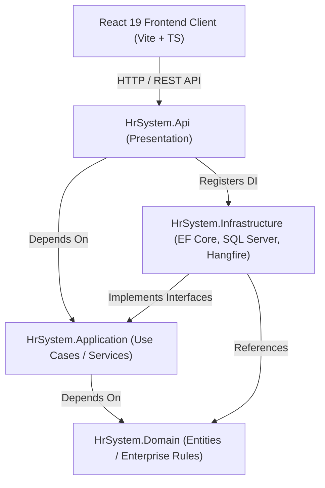
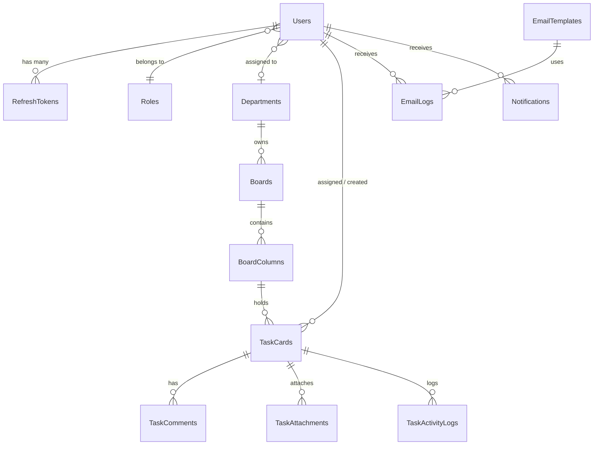
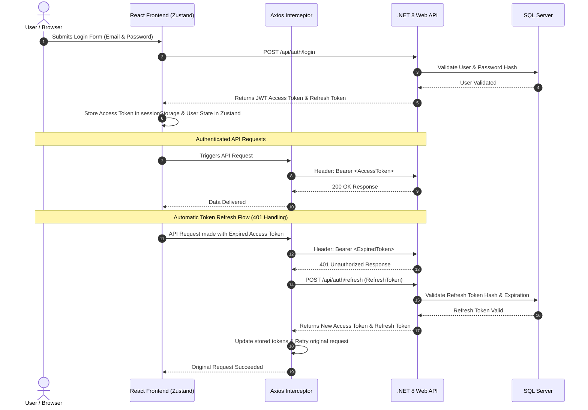

# WorkTrail Portal

[](https://dotnet.microsoft.com/)
[](https://react.dev/)
[](https://www.typescriptlang.org/)
[](https://tailwindcss.com/)
[](https://www.microsoft.com/sql-server)
[](https://learn.microsoft.com/ef/core/)
[](LICENSE)
[]()

**WorkTrail Portal** is an enterprise-grade Human Resource Management System (HRMS) and Agile Task Tracking Platform. Engineered using **Clean Architecture** on the backend (.NET 8 Web API) and a high-performance **React 19 + TypeScript + Vite** frontend, WorkTrail Portal delivers seamless workforce administration, multi-board Kanban project management, automated asynchronous communications, real-time analytics, and an integrated AI assistant.

---

## 📋 Table of Contents

- [Project Description](#-project-description)
- [Features](#-features)
- [Screenshots](#-screenshots)
- [Tech Stack](#-tech-stack)
- [Folder Structure](#-folder-structure)
- [Installation](#-installation)
- [Environment Variables](#-environment-variables)
- [Project Architecture](#-project-architecture)
- [User Roles & Permissions](#-user-roles--permissions)
- [UI & UX Features](#-ui--ux-features)
- [API Endpoints](#-api-endpoints)
- [Database Schema & EF Core](#-database-schema--ef-core)
- [Authentication Flow](#-authentication-flow)
- [Build & Deployment](#-build--deployment)
- [Future Enhancements](#-future-enhancements)
- [Contributors](#-contributors)
- [License](#-license)
- [Author](#-author)

---

## 🎯 Project Description

**WorkTrail Portal** was created to bridge the gap between employee management, organizational visibility, and agile task execution. Built for modern enterprises, human resource teams, department heads, and individual contributors, WorkTrail Portal centralizes daily HR workflows and project execution into a unified workspace.

### Key Objectives
* **Workforce Administration**: Manage employee records, department structures, reporting hierarchies, and user access levels with department-scoped privacy boundaries.
* **Agile Task Boards**: Provide multi-column Kanban boards supporting drag-and-drop card positioning, LexoRank double-precision ordering, priority tagging, markdown comments, file attachments, and activity logging.
* **Data Integrity & Concurrency**: Safeguard collaborative card edits using SQL Server binary tokens (`RowVersion`) and EF Core Optimistic Concurrency Control to prevent lost updates.
* **Automated Asynchronous Email Center**: Queue and dispatch HTML email communications using Hangfire background jobs, Gmail SMTP, and strict idempotency key protection.
* **AI Nexus Assistant**: Empower users with an integrated natural language AI copilot powered by **NVIDIA NIM (`meta/llama-3.1-70b-instruct`)**, featuring intent routing, capability extraction, and contextual RAG queries.
* **Real-time Analytics**: Present high-impact interactive data visualizations for team workload balance, task completion velocity, and department distributions.

---

## ✨ Features

### 🔐 Authentication & Session Management
* **JWT Bearer Token Authentication**: Secure token-based access control with short-lived access tokens (15 mins) and long-lived refresh tokens (7 days).
* **Silent Token Refresh & Interceptor Queue**: Axios response interceptors automatically process token renewal when expired without interrupting user actions.
* **Session Tracking & Revocation**: Users can view all active login sessions and remotely terminate individual sessions or clear all other sessions.
* **BCrypt Password Security**: Secure password hashing with standard work factors and validation enforcement.

### 📊 Executive Dashboard
* **Task Velocity Chart**: Recharts area visualization measuring completed task velocity over dynamic time ranges (e.g. 7, 30, 90 days) and intervals.
* **Department Distribution**: Interactive donut pie chart analyzing employee concentration across organizational units.
* **Workload Balance Chart**: Bar chart evaluating active task assignments per employee to prevent burnout and spot capacity bottlenecks.
* **System Activity Feed**: Live audit timeline streaming recent task movements, board updates, and user activity across the workspace.

### 👥 Employee Management
* **User Directory & Filtering**: Paginated table view with role badges, department tags, search inputs, and status filters.
* **Self-Service Profile Portal**: User settings page for updating display names, contact emails, security credentials, and preferences.
* **Avatar Upload Service**: Local static storage and Azure Blob Storage integration for profile avatars (supports JPG, PNG, WebP up to 2MB).
* **Manager Hierarchies**: Self-referencing manager-to-direct-report relations for enterprise hierarchy modeling.

### 🏢 Department Management
* **Department Registry**: Complete management of organizational units (e.g., Engineering, HR, Marketing).
* **Scope Enforcers**: Access restriction policies enforcing HR scope boundaries to users within their assigned department.

### 📋 Board & Task Management (Kanban)
* **Multi-Board Navigation**: Create, update, and manage board workspaces linked to specific departments or global scopes.
* **Custom Columns**: Dynamically create, rename, and reorder workflow columns (e.g., Backlog, In Progress, In Review, Done).
* **Drag-and-Drop Cards**: Smooth visual drag-and-drop powered by `@hello-pangea/dnd` and `@dnd-kit`.
* **LexoRank Positioning**: Floating-point card ordering algorithm allowing card reordering without full column re-indexing.
* **Card Drawer & Modal**: Detailed task inspection with priority indicators (Low, Medium, High), assignees, description, attachments, and nested comment threads.
* **Optimistic Concurrency**: `RowVersion` concurrency tokens prevent simultaneous overwrites when multiple team members edit task cards concurrently.

### ✉️ Email Center & Asynchronous Messaging
* **Template Builder**: Create and store reusable HTML email templates with dynamic placeholders (`{{UserName}}`, `{{TaskTitle}}`, etc.).
* **Quick Access Shortcuts**: Pin high-frequency email templates for single-click execution.
* **Background Job Queue**: Offload email delivery to **Hangfire** background workers with Gmail SMTP integration.
* **Idempotency Guard**: Unique idempotency key constraints on `EmailLogs` prevent duplicate email dispatches during network retries or double submits.

### 📜 Audit Logs
* **System Task Activity Logs**: Immutable log history tracking every card creation, column move, property update, comment addition, and file attachment.
* **Audit Trail Portal**: Administrative audit view with actor timestamps, action filters, and clear log permissions.

### 🔍 Global Search & Command Palette
* **Command Palette Modal (`Ctrl + K` / `Cmd + K`)**: Instant search overlay querying across Tasks, Boards, Employees, and Departments simultaneously.
* **Instant Results & Deep Linking**: Real-time filtering with visual category badges and direct navigation routing.

### 🌗 Dark & Light Theme System
* **Global Theme Provider**: Zustand persistent state (`uiStore`) with `data-theme="dark"` / `data-theme="light"` CSS variable binding.
* **Apple-Style Theme Switcher**: Glassmorphic smooth-sliding toggle control with sun and moon icons.
* **System Preference Detection**: Auto-detects user OS `prefers-color-scheme` settings on initial app startup.

### 🛡️ Role-Based Access Control (RBAC)
* **Triple Role Tier**: Fine-grained role hierarchy distinguishing `Admin`, `HR`, and `Employee` permissions.
* **Declarative Role Gates**: Front-end `<RoleGate>` components and custom route wrappers preventing unauthorized component renders.
* **Backend Policy Handlers**: Custom ASP.NET Core `HrSameDepartmentHandler` policy handlers enforcing data access rules.

### 🤖 AI Nexus Assistant
* **NVIDIA NIM LLM Engine**: Powered by `meta/llama-3.1-70b-instruct` via NVIDIA NIM endpoint API.
* **Intent Routing Architecture**: Automatically routes incoming natural language requests into specific capabilities (Tasks, Departments, Employees, Boards).
* **RAG Synthetic Retrieval**: Context builders populate user metadata, role context, and relevant entities before submitting prompts.
* **Nexus Companion Chat UI**: Floating drawer widget with markdown rendering (`react-markdown`), syntax highlighting, quick action chips, and command palette integration.

### 🎨 UI/UX & Micro-Animations
* **Framer Motion Animations**: Smooth page transitions (`PageTransition`), modal entry animations, and hover micro-interactions.
* **Animated Login Background**: Particle waterfall and glowing ambient backdrop effects (`AnimatedBackground`, `Waterfall`).
* **Interactive Confetti Effects**: Triggers celebratory milestone confetti (`canvas-confetti`) when completing tasks.

---

## 🖼️ Screenshots

> *Note: Replace placeholder image paths below with actual application screenshots.*

<details>
<summary>📸 Click to view screenshot placeholders</summary>

| View | Dark Theme | Light Theme |
| :--- | :--- | :--- |
| **Login Screen** | `/screenshots/login-dark.png` | `/screenshots/login-light.png` |
| **Dashboard** | `/screenshots/dashboard-dark.png` | `/screenshots/dashboard-light.png` |
| **Employees** | `/screenshots/employees.png` | — |
| **Departments** | `/screenshots/departments.png` | — |

</details>

---

## 💻 Tech Stack

### Frontend Architecture
| Category | Technology | Description |
| :--- | :--- | :--- |
| **Core Framework** | React 19 | Library for modern user interfaces |
| **Build Tool** | Vite 8 | Next-generation fast frontend tooling |
| **Language** | TypeScript 6 | Strongly-typed JavaScript superset |
| **Styling** | Tailwind CSS v4 + PostCSS | Utility-first CSS framework |
| **State Management** | Zustand v5 | Lightweight, fast global state manager |
| **Data Fetching** | TanStack React Query v5 | Server state management and caching |
| **Routing** | React Router v7 | Client-side declarative routing |
| **Form Management** | React Hook Form + Zod | Type-safe form parsing and validation |
| **Drag & Drop** | `@hello-pangea/dnd`, `@dnd-kit` | Accessible Kanban drag and drop |
| **Animations** | Framer Motion v12 | Production-ready motion animations |
| **Charts** | Recharts v3 | Composable SVG data visualizations |
| **HTTP Client** | Axios v1.18 | Request/response interceptor HTTP library |
| **Icons** | Lucide React | Clean, scalable UI icon set |

### Backend Architecture
| Category | Technology | Description |
| :--- | :--- | :--- |
| **Framework** | .NET 8 Web API | High-performance enterprise cross-platform Web API |
| **Design Pattern** | Clean Architecture | Decoupled Domain, Application, Infrastructure, and API layers |
| **Database** | Microsoft SQL Server | Relational database engine |
| **ORM** | Entity Framework Core 8 | Code-first database mapping & LINQ queries |
| **Background Processing**| Hangfire v1.8 | Asynchronous background job processing dashboard & workers |
| **Security & Auth** | JWT + BCrypt.Net | Token authentication & password hashing |
| **Validation** | FluentValidation | Expressive validation rules for request DTOs |
| **AI Integration** | NVIDIA NIM API | Llama 3.1 70B Instruct LLM Integration |
| **API Specs** | Swagger / OpenAPI 3.0 | API documentation & interactive testing sandbox |
| **File Storage** | Azure Blob Storage & Local | Profile avatar binary storage |

---

## 📁 Folder Structure

```text
HR-Managment/
├── client/                             # Frontend React Application
│   ├── public/                         # Public static web assets
│   ├── src/
│   │   ├── api/                        # Axios H
TTP client & API service calls
│   │   │   ├── audit.api.ts
│   │   │   ├── auth.api.ts
│   │   │   ├── axios.ts                # Interceptors for JWT & token refresh
│   │   │   ├── boards.api.ts
│   │   │   ├── cards.api.ts
│   │   │   ├── dashboard.api.ts
│   │   │   ├── departments.api.ts
│   │   │   ├── email.api.ts
│   │   │   ├── notifications.api.ts
│   │   │   ├── profile.api.ts
│   │   │   ├── search.api.ts
│   │   │   └── users.api.ts
│   │   ├── assets/                     # SVG icons and static graphic assets
│   │   ├── auth/                       # Protected routes & role gates
│   │   ├── components/                 # React UI component tree
│   │   │   ├── boards/                 # CardColumnContainer, SortableCard, CardPreview
│   │   │   ├── cards/                  # CardModal detail view
│   │   │   ├── dashboard/              # TaskVelocity, Workload, Distribution charts
│   │   │   ├── layout/                 # AppShell, TopBar, Sidebar, GlobalSearch
│   │   │   ├── settings/               # Profile and security forms
│   │   │   ├── shared/                 # ThemeToggle, Modal, Buttons, Badges, ChatWidget
│   │   │   └── ui/                     # Animated Sign-In Card components
│   │   ├── hooks/                      # Custom React hooks
│   │   ├── lib/                        # Utility functions (clsx, tailwind-merge)
│   │   ├── pages/                      # Page view views
│   │   │   ├── AuditLogPage.tsx
│   │   │   ├── BoardDetailPage.tsx
│   │   │   ├── BoardListPage.tsx
│   │   │   ├── DashboardPage.tsx
│   │   │   ├── DepartmentListPage.tsx
│   │   │   ├── EmailCenterPage.tsx
│   │   │   ├── ForbiddenPage.tsx
│   │   │   ├── LandingPage.tsx
│   │   │   ├── LoginPage.tsx
│   │   │   ├── SettingsPage.tsx
│   │   │   └── UserManagementPage.tsx
│   │   ├── store/                      # Zustand state slices (authStore, uiStore)
│   │   ├── styles/                     # CSS stylesheets & theme variables
│   │   ├── types/                      # Shared TypeScript definitions
│   │   ├── App.css
│   │   ├── App.tsx
│   │   ├── index.css                   # Tailwind directive entry
│   │   ├── main.tsx                    # React Root mount
│   │   └── routes.tsx                  # React Router v7 configuration
│   ├── index.html
│   ├── package.json
│   ├── tailwind.config.js
│   ├── tsconfig.json
│   └── vite.config.ts
├── src/                                # Backend .NET 8 Web API
│   ├── HrSystem.Api/                   # Presentation Layer (API Controllers & Pipeline)
│   │   ├── Controllers/                # REST Controllers (Auth, Users, Boards, etc.)
│   │   ├── Converters/                 # Custom JSON Converters (UtcDateTimeConverter)
│   │   ├── Filters/                    # GlobalExceptionFilter, HangfireAdminFilter
│   │   ├── Middleware/                 # GlobalExceptionMiddleware
│   │   ├── Services/                   # AvatarService for file management
│   │   ├── appsettings.json            # Configuration template
│   │   ├── Program.cs                  # Service Registration & Middleware Pipeline
│   │   └── HrSystem.Api.csproj
│   ├── HrSystem.Application/           # Core Application Logic Layer
│   │   ├── Assistant/                  # AI Assistant (IntentRouting, Capabilities, RAG)
│   │   ├── DTOs/                       # Data Transfer Objects
│   │   ├── Exceptions/                 # Custom Domain Exceptions
│   │   ├── Interfaces/                 # Repository & Service Interfaces
│   │   ├── Security/                   # JwtTokenGenerator, BCryptPasswordHasher
│   │   ├── Services/                   # Core Business Services
│   │   ├── Validators/                 # FluentValidation request DTO rules
│   │   └── HrSystem.Application.csproj
│   ├── HrSystem.Domain/                # Domain Entities & Enums Layer
│   │   ├── Entities/                   # User, Board, TaskCard, EmailLog, Notification, etc.
│   │   ├── Enums/                      # RoleType, TaskPriority, EmailLogStatus, etc.
│   │   └── HrSystem.Domain.csproj
│   └── HrSystem.Infrastructure/        # Data Infrastructure & Persistence Layer
│       ├── Email/                      # Gmail SMTP sender & template renderer
│       ├── Jobs/                       # Hangfire background worker (EmailDispatchJob)
│       ├── Migrations/                 # EF Core SQL Database Migrations
│       ├── Persistence/                # HrDbContext, Repositories, DbInitializer
│       └── HrSystem.Infrastructure.csproj
├── tests/                              # Automated Test Project
│   └── HrSystem.Tests/
│       ├── Integration/                # Integration tests using WebApplicationFactory
│       ├── Unit/                       # Service, Auth, and Algorithm unit tests
│       └── HrSystem.Tests.csproj
├── HrSystem.sln                        # Visual Studio Solution Manifest
├── package.json                        # Root package manifest
├── README.md                           # Project Documentation
└── run.bat                             # Windows startup script
```

---

## ⚙️ Installation

### Prerequisites
Before running WorkTrail Portal, ensure you have the following software installed:
* **[.NET 8.0 SDK](https://dotnet.microsoft.com/download/dotnet/8.0)**
* **[Node.js](https://nodejs.org/)** (v18.0 or higher) & **npm** (v9.0 or higher)
* **[SQL Server](https://www.microsoft.com/sql-server)** (LocalDB or SQL Express/Developer Instance)

---

### Step-by-Step Installation

#### 1. Clone the Repository
```bash
git clone https://github.com/Ayush95697/HR-Managment.git
cd HR-Managment
```

#### 2. Restore Backend Dependencies
```bash
dotnet restore
```

#### 3. Install Frontend Dependencies
```bash
cd client
npm install
cd ..
```

#### 4. Configure Environment Secrets
Configure your local database connection string and JWT secret. You can add a `.env` file in the project root or set standard environment variables:

```bash
# In Windows PowerShell or bash:
dotnet user-secrets set "ConnectionStrings:DefaultConnection" "Server=(localdb)\\mssqllocaldb;Database=HrSystemDb;Trusted_Connection=True;MultipleActiveResultSets=true" --project src/HrSystem.Api
dotnet user-secrets set "JwtSettings:Secret" "YOUR_SUPER_SECRET_KEY_MINIMUM_32_CHARACTERS_LONG" --project src/HrSystem.Api
```

#### 5. Run Database Migrations & Seed
The database schema and initial test data (Users, Departments, Boards, Cards) are seeded automatically when launching the API service in development.

#### 6. Start the Backend API
```bash
cd src/HrSystem.Api
dotnet run
```
* Backend Web API will be listening at: `http://localhost:5000` (or configured HTTP/HTTPS ports).
* Interactive Swagger API documentation: `http://localhost:5000/swagger`.
* Hangfire Background Jobs Dashboard: `http://localhost:5000/hangfire`.

#### 7. Start the Frontend Application
Open a new terminal window:
```bash
cd client
npm run dev
```
* Frontend app will start at: `http://localhost:5173`.

---

### 🚀 Quick Launch (Windows)
Alternatively, start both backend and frontend applications concurrently using the root batch script:
```cmd
run.bat
```

---

### 🧪 Running Automated Tests
Run unit and integration test suites:
```bash
dotnet test
```

---

## 🔑 Environment Variables

The application reads variables from system environment variables, local `.env` files, `appsettings.json`, or `.NET User Secrets`.

| Environment Variable | Source / Section | Default Value | Required | Purpose |
| :--- | :--- | :--- | :---: | :--- |
| `ConnectionStrings__DefaultConnection` | `ConnectionStrings:DefaultConnection` | `""` | **Yes** | SQL Server database connection string |
| `JwtSettings__Secret` | `JwtSettings:Secret` | `""` | **Yes** | Secret signing key for JWT tokens (Min 32 chars) |
| `JwtSettings__Issuer` | `JwtSettings:Issuer` | `HrSystemApi` | No | JWT Token Issuer claim validator |
| `JwtSettings__Audience` | `JwtSettings:Audience` | `HrSystemApp` | No | JWT Token Audience claim validator |
| `JwtSettings__AccessTokenExpirationMinutes` | `JwtSettings:AccessTokenExpirationMinutes` | `15` | No | Access token expiration lifetime in minutes |
| `JwtSettings__RefreshTokenExpirationDays` | `JwtSettings:RefreshTokenExpirationDays` | `7` | No | Refresh token expiration lifetime in days |
| `Email__FromAddress` | `Email:FromAddress` | `""` | No | Sender email address for Gmail SMTP dispatch |
| `Email__GmailPassword` | `Email:GmailPassword` | `""` | No | App Password for Gmail SMTP authentication |
| `AzureStorage__ConnectionString` | `AzureStorage:ConnectionString` | `""` | No | Connection string for Azure Blob Storage avatars |
| `AzureStorage__AvatarContainerName` | `AzureStorage:AvatarContainerName` | `avatars` | No | Blob container name for stored avatars |
| `Assistant__Provider` | `Assistant:Provider` | `Nvidia` | No | AI Assistant provider selection |
| `Assistant__Model` | `Assistant:Model` | `meta/llama-3.1-70b-instruct` | No | NVIDIA NIM LLM Model identifier |
| `Assistant__Endpoint` | `Assistant:Endpoint` | `https://integrate.api.nvidia.com/...` | No | LLM completion API endpoint |
| `NVIDIA_NIM_API_KEY` | `NVIDIA_NIM_API_KEY` | `""` | No | API Key for NVIDIA NIM LLM queries |

---

## 🏗️ Project Architecture

WorkTrail Portal strictly follows **Clean Architecture** principles to separate concerns, enforce maintainability, and keep business logic isolated from external frameworks.



### Architecture Breakdown

1. **Frontend Layer (`client`)**: SPA developed with React 19, TypeScript, Zustand, and TanStack Query. Interacts with the backend solely via RESTful JSON APIs.
2. **Presentation Layer (`HrSystem.Api`)**: Handles HTTP requests, CORS policies, JWT Authentication filters, global exception handling middleware, Swagger documentation generation, and static file serving.
3. **Application Core Layer (`HrSystem.Application`)**: Contains core application services, DTO definitions, interfaces (`IUserRepository`, `ITaskCardService`), request validation rules (`FluentValidation`), and the AI Nexus Assistant intent routing pipeline.
4. **Domain Layer (`HrSystem.Domain`)**: Pure domain models (`User`, `TaskCard`, `Board`, `EmailLog`), domain enums (`RoleType`, `TaskPriority`), and entity relationships without external framework dependencies.
5. **Infrastructure Layer (`HrSystem.Infrastructure`)**: Handles EF Core database context (`HrDbContext`), database initialization & seeding (`DbInitializer`), Hangfire background job processing (`EmailDispatchJob`), and Gmail SMTP delivery handlers.

---

## 👥 User Roles & Permissions

WorkTrail Portal supports three distinct user roles with strict server-side policy enforcement:

| Feature / Resource | Admin | HR Manager | Employee |
| :--- | :---: | :---: | :---: |
| **Manage Users (Create/Update/Delete)** | ✅ Full Access | ❌ No Access | ❌ No Access |
| **Manage Departments (Create/Delete)** | ✅ Full Access | 👁️ Read Only | 👁️ Read Only |
| **Create & Edit Boards / Columns** | ✅ Full Access | ✅ Department Scope | ❌ No Access |
| **Create & Delete Task Cards** | ✅ Full Access | ✅ Department Scope | ❌ No Access |
| **Move Task Cards / Drag & Drop** | ✅ Full Access | ✅ Department Scope | ✅ Permitted Boards |
| **Comment & View Task Details** | ✅ Full Access | ✅ Department Scope | ✅ Permitted Boards |
| **Send Templated Emails** | ✅ System-Wide | ✅ Department Scope | ❌ No Access |
| **View Audit & System Logs** | ✅ Full Access | ✅ Department Scope | ❌ No Access |
| **Clear Audit Logs & Email Logs** | ✅ Full Access | ❌ No Access | ❌ No Access |
| **Executive Dashboard Analytics** | ✅ All Depts | ✅ Own Dept | ❌ Redirect to Boards |
| **Self-Service Profile & Avatar Update** | ✅ Full Access | ✅ Full Access | ✅ Full Access |
| **AI Nexus Assistant** | ✅ Full Access | ✅ Full Access | ✅ Full Access |

---

## 🎨 UI & UX Features

* **Dark & Light Mode**: Seamless theme switching supported by CSS variables, stored persistently in `localStorage` and managed globally via Zustand.
* **Apple-Style Theme Switcher**: Modern glassmorphic slider control embedded in the top bar navigation.
* **Animated Login Background**: Particle waterfall animations created with Canvas and Framer Motion for an impressive aesthetic experience.
* **Responsive Layout**: Collapsible sidebar navigation, mobile app drawer, and fluid grid layouts optimized across desktop, tablet, and mobile devices.
* **Modern Executive Dashboard**: High-resolution interactive charts for Task Velocity, Department Distribution, and Workload Balance built with SVG Recharts.
* **Command Palette Global Search (`Ctrl+K`)**: Modal overlay allowing instantaneous cross-entity searches with immediate keyboard shortcuts.
* **Live Notifications**: Top-bar unread counter dropdown with one-click "Mark all as read" functionality.

---

## 📡 API Endpoints

<details>
<summary>🔍 Click to expand full API Endpoint reference documentation</summary>

### 🔑 Authentication (`/api/auth`)
| Method | Endpoint | Purpose | Access |
| :--- | :--- | :--- | :--- |
| `POST` | `/api/auth/login` | Authenticate user credentials and return JWT & Refresh Token | Public |
| `POST` | `/api/auth/refresh` | Issue new Access Token using valid Refresh Token | Public |
| `POST` | `/api/auth/logout` | Revoke active Refresh Token | Authenticated |

### 👤 User Management (`/api/users`)
| Method | Endpoint | Purpose | Access |
| :--- | :--- | :--- | :--- |
| `GET` | `/api/users` | Retrieve list of users (scoped by role/department) | Authenticated |
| `GET` | `/api/users/{id}` | Get user details by ID | Authenticated |
| `POST` | `/api/users` | Create a new employee profile | Admin |
| `PUT` | `/api/users/{id}` | Update employee profile or role | Admin |
| `DELETE` | `/api/users/{id}` | Soft delete employee account | Admin |
| `GET` | `/api/users/me` | Fetch authenticated user profile | Authenticated |
| `PUT` | `/api/users/me` | Update authenticated user profile | Authenticated |
| `POST` | `/api/users/me/avatar` | Upload user profile avatar image (Max 2MB) | Authenticated |
| `DELETE` | `/api/users/me/avatar` | Remove user profile avatar image | Authenticated |
| `POST` | `/api/users/me/change-password` | Change user account password | Authenticated |
| `GET` | `/api/users/me/sessions` | Fetch active user login sessions | Authenticated |
| `DELETE` | `/api/users/me/sessions/{id}` | Terminate specific login session | Authenticated |
| `DELETE` | `/api/users/me/sessions` | Terminate all other active login sessions | Authenticated |

### 🏢 Department Management (`/api/departments`)
| Method | Endpoint | Purpose | Access |
| :--- | :--- | :--- | :--- |
| `GET` | `/api/departments` | List all departments | Authenticated |
| `GET` | `/api/departments/{id}` | Get department details by ID | Authenticated |
| `POST` | `/api/departments` | Create new department | Admin |
| `DELETE` | `/api/departments/{id}` | Delete department | Admin |

### 📋 Board Management (`/api/boards`)
| Method | Endpoint | Purpose | Access |
| :--- | :--- | :--- | :--- |
| `GET` | `/api/boards` | List accessible Kanban boards | Authenticated |
| `GET` | `/api/boards/{id}` | Get board detail with columns and cards | Authenticated |
| `POST` | `/api/boards` | Create a new Kanban board | HR, Admin |
| `PUT` | `/api/boards/{id}` | Update board title or metadata | HR, Admin |
| `DELETE` | `/api/boards/{id}` | Delete Kanban board | HR, Admin |
| `POST` | `/api/boards/{boardId}/columns` | Add column to board | HR, Admin |

### 🗂️ Column Management (`/api/columns`)
| Method | Endpoint | Purpose | Access |
| :--- | :--- | :--- | :--- |
| `PUT` | `/api/columns/{id}` | Update column name or order position | HR, Admin |
| `DELETE` | `/api/columns/{id}` | Delete column and associated cards | HR, Admin |

### 📌 Task Card Management (`/api`)
| Method | Endpoint | Purpose | Access |
| :--- | :--- | :--- | :--- |
| `GET` | `/api/boards/{boardId}/cards` | Fetch all task cards for a board | Authenticated |
| `POST` | `/api/boards/{boardId}/cards` | Create new task card on board | HR, Admin |
| `GET` | `/api/cards/{id}` | Fetch card detail with comments & activity | Authenticated |
| `PATCH` | `/api/cards/{id}` | Update card details, column, or order position | HR, Admin |
| `DELETE` | `/api/cards/{id}` | Delete task card | HR, Admin |
| `POST` | `/api/cards/{id}/comments` | Add comment to card | Authenticated |
| `GET` | `/api/cards/{id}/activity` | Fetch activity log timeline for card | Authenticated |

### 📊 Dashboard & Analytics (`/api/dashboard`)
| Method | Endpoint | Purpose | Access |
| :--- | :--- | :--- | :--- |
| `GET` | `/api/dashboard/task-velocity` | Fetch task completion velocity timeline metrics | HR, Admin |
| `GET` | `/api/dashboard/department-distribution` | Fetch department headcount distribution breakdown | Admin |
| `GET` | `/api/dashboard/workload-balance` | Fetch team task workload distribution | HR, Admin |
| `GET` | `/api/dashboard/activity-feed` | Fetch paginated system activity feed | HR, Admin |

### ✉️ Email Center (`/api/email`)
| Method | Endpoint | Purpose | Access |
| :--- | :--- | :--- | :--- |
| `GET` | `/api/email/templates` | Retrieve list of email templates | Authenticated |
| `POST` | `/api/email/templates` | Create email template | HR, Admin |
| `DELETE` | `/api/email/templates/{id}` | Delete email template | HR, Admin |
| `PUT` | `/api/email/templates/{id}/toggle-quick-access` | Toggle template quick-access pin | HR, Admin |
| `POST` | `/api/email/send` | Queue email dispatch job via Hangfire worker | HR, Admin |
| `GET` | `/api/email/logs` | Fetch email dispatch execution history logs | HR, Admin |
| `DELETE` | `/api/email/logs/clear` | Clear email dispatch logs | Admin |

### 📜 Audit Logs (`/api/audit`)
| Method | Endpoint | Purpose | Access |
| :--- | :--- | :--- | :--- |
| `GET` | `/api/audit/logs` | Retrieve system-wide task activity and audit logs | HR, Admin |
| `DELETE` | `/api/audit/clear` | Clear system audit logs | Admin |

### 🔔 Notifications (`/api/notifications`)
| Method | Endpoint | Purpose | Access |
| :--- | :--- | :--- | :--- |
| `GET` | `/api/notifications` | Fetch paginated user notifications | Authenticated |
| `GET` | `/api/notifications/unread-count` | Get unread notification badge count | Authenticated |
| `PATCH` | `/api/notifications/{id}/read` | Mark specific notification as read | Authenticated |
| `POST` | `/api/notifications/mark-all-read` | Mark all user notifications as read | Authenticated |

### 🔍 Global Search (`/api/search`)
| Method | Endpoint | Purpose | Access |
| :--- | :--- | :--- | :--- |
| `GET` | `/api/search?q={query}` | Execute cross-entity search across tasks, boards, users, depts | Authenticated |

### 🤖 AI Nexus Assistant (`/api/chat`)
| Method | Endpoint | Purpose | Access |
| :--- | :--- | :--- | :--- |
| `POST` | `/api/chat` | Submit natural language query to AI Nexus Copilot | Authenticated |

### 🌱 Database Seeding (`/api/seed`)
| Method | Endpoint | Purpose | Access |
| :--- | :--- | :--- | :--- |
| `POST` | `/api/seed/generate` | Generate mock test dataset in database | Public (Dev) |

</details>

---

## 🗄️ Database Schema & EF Core

WorkTrail Portal utilizes Microsoft SQL Server managed through Entity Framework Core 8 Code-First migrations.



### Primary Database Models

* **`User`**: Core user record storing name, email, BCrypt password hash, avatar URL, role ID (`RoleId`), assigned department (`DepartmentId`), manager ID (`ManagerId`), theme preferences, and timestamps.
* **`Role`**: Enum entity representing access levels (1 = Admin, 2 = HR, 3 = Employee).
* **`Department`**: Organizational unit container.
* **`Board`**: Kanban workspace owned by a user (`OwnerId`) and assigned to a department (`DepartmentId`).
* **`BoardColumn`**: Individual board step (e.g. Backlog, Doing, Done) ordered by integer order.
* **`TaskCard`**: Individual task containing title, description, priority enum (`Low`, `Medium`, `High`), double position (`Position`), assignee ID, creator ID, and an 8-byte `RowVersion` concurrency binary token.
* **`TaskComment`**: Comment entry on a card by an author.
* **`TaskAttachment`**: Uploaded file metadata reference associated with a card.
* **`TaskActivityLog`**: System activity entry tracking card column transitions and edits.
* **`EmailTemplate`**: HTML template entity with title, subject, body, and quick-access flags.
* **`EmailLog`**: Asynchronous dispatch log with unique `IdempotencyKey`, status (`Queued`, `Sent`, `Failed`), recipient, and failure logs.
* **`RefreshToken`**: SHA-256 hashed refresh token record linked to a user.
* **`Notification`**: In-app notification item linked to a recipient, action type, card, and board.

---

## 🔒 Authentication Flow



---

## 📦 Build & Deployment

### Production Build

#### 1. Build Frontend Application
```bash
cd client
npm run build
```
The compiled SPA production bundle will be generated in `client/dist/`.

#### 2. Publish Backend Web API
```bash
cd src/HrSystem.Api
dotnet publish -c Release -o ./publish
```
The published binary files will be generated in `src/HrSystem.Api/publish/`.

---

## 🔮 Future Enhancements

* **SignalR Real-Time Collaboration**: Real-time multi-user live card dragging, presence indicators, and instant comment updates over WebSockets.
* **OAuth2 / Social Logins**: Integration with Microsoft Entra ID (Azure AD) and Google Workspace SSO.
* **Export & Reporting Center**: PDF and Excel dataset export services for department analytics and activity audit reports.
* **Mobile Companion App**: Native React Native / Expo mobile application for iOS and Android.

---

## 🤝 Contributors

Contributions, issues, and feature requests are welcome! Feel free to check the [issues page](https://github.com/Ayush95697/HR-Managment/issues).

* **Ayush Pal** ([@Ayush95697](https://github.com/Ayush95697)) - *Lead Architecture & Full Stack Engineering*
* **Akshay Pal**

---

## 📜 License

This project is open-source and licensed under the **[MIT License](LICENSE)**.

---

## 🏢 Author

**WorkTrail Team**
* GitHub Repository: [https://github.com/Ayush95697/HR-Managment](https://github.com/Ayush95697/HR-Managment)
* Built with ❤️ using .NET 8, React 19, TypeScript, and SQL Server.
